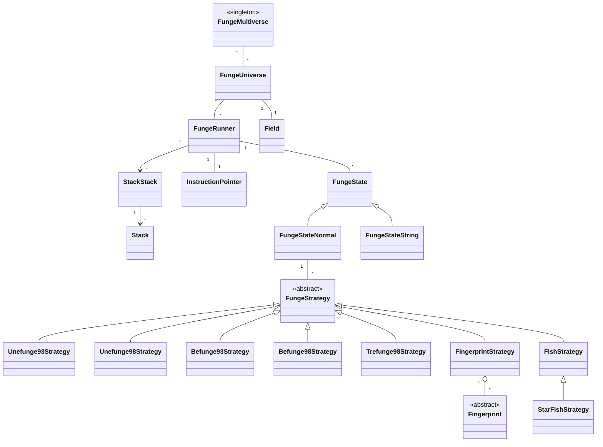

# Funge++ Software Design

```mermaid
classDiagram
	FungeMultiverse "1" -- "*" FungeUniverse
	<<singleton>> FungeMultiverse
	FungeUniverse "1" -- "*" FungeRunner
	FungeUniverse "1" -- "1" Field

	FungeRunner "1" -- "*" FungeState
	FungeRunner "1" -- "1" InstructionPointer
	FungeRunner "1" --> "1" StackStack
	StackStack "1" --> "*" Stack

	FungeState <|-- FungeStateNormal
	FungeState <|-- FungeStateString
	FungeStateNormal "1" -- "*" FungeStrategy
	<<abstract>> FungeStrategy
	FungeStrategy <|-- Unefunge93Strategy
	FungeStrategy <|-- Unefunge98Strategy
	FungeStrategy <|-- Befunge93Strategy
	FungeStrategy <|-- Befunge98Strategy
	FungeStrategy <|-- Trefunge98Strategy
	FungeStrategy <|-- FingerprintStrategy

	FingerprintStrategy "1" o-- "*" Fingerprint
	<<abstract>> Fingerprint

	FungeStrategy <|-- FishStrategy
	FishStrategy <|-- StarFishStrategy
```
